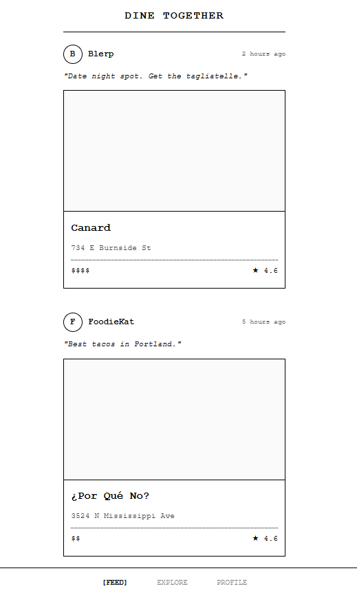
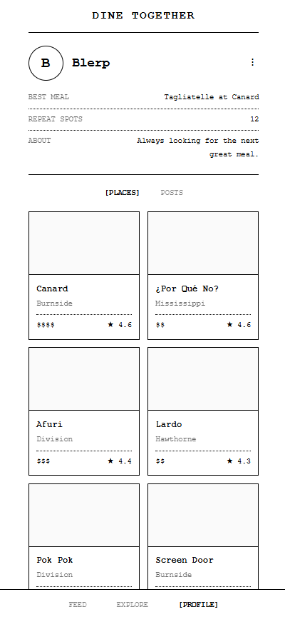
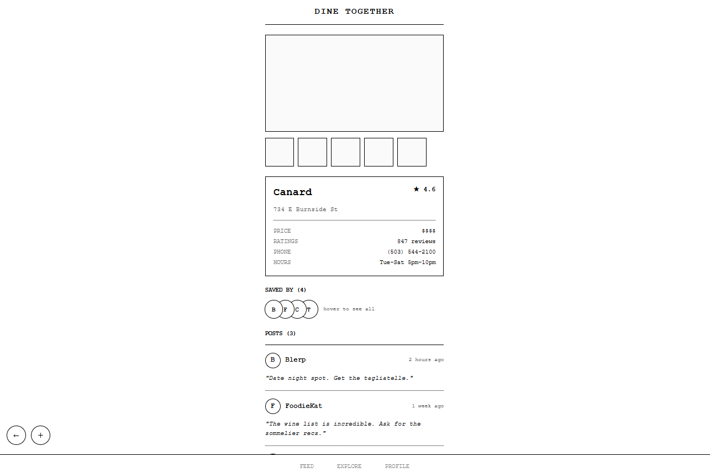
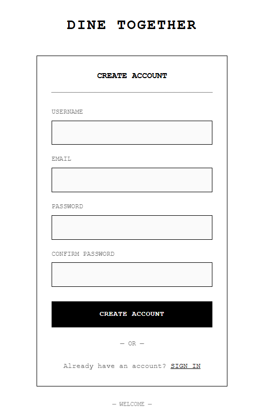
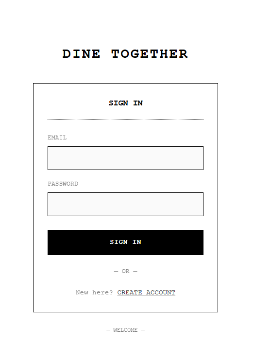

# **Dine-Together**

### By *Ashe Urban*

---

## Table of Contents

- [Project Overview](#project-overview)
- [Technologies Used](#technologies-used)
- [Architecture](#architecture)
  - [Service Layer Pattern](#service-layer-pattern)
  - [Firestore Schema](#firestore-schema)
- [Goals & Problems Solved](#goals--problems-solved)
- [Diagrams & Design](#diagrams--design)
- [Known Bugs](#known-bugs---updated-11226)
- [Setup / Installation](#setup--installation-main-branch)
- [Project Structure](#project-structure)
- [Development Roadmap](#development-roadmap)
- [Development Process Disclaimer](#development-process-disclaimer)
- [License](#license)

---

## **Project Overview**
**Ongoing Independent Project** 

Dine Together is an active, full-stack React prototype exploring how social restaurant discovery and shared dining experiences can live in one place. The application allows users to create and share restaurant posts, save places they want to try, and explore dining recommendations through a community-driven feed.

The current JavaScript MVP focuses on core social functionality and scalable architecture, including Firebase Authentication, Firestore data modeling, protected routes, and a service-layer approach that separates UI concerns from data access. As part of this phase, the application will integrate the Google Places API to support real restaurant search, autocomplete, and enriched place data within the app experience.

Following MVP polish, the project is planned to be refactored to TypeScript with expanded tooling and libraries to support larger user bases and more advanced features. Future phases aim to introduce deeper social connections and explore APIs that enable in-app reservation workflows, building toward a more complete end-to-end dining coordination platform.

---

**Current Status:** V2 "receipt-style" redesign in progress. Footer navigation added, ActionBar repositioned, SignIn/SignUp updated. Style audit completed. Phase 3 (Google Places photos) complete. Next: PlaceProfile V2 design.

---

**Remodel branch** is the active development branch where all new work happens. All features are implemented here first.

**Main branch** is a functional snapshot synced with remodel on 2026-02-01. It represents the current state of work and runs without errors, though some features are pending implementation.

| Branch | Status | Focus |
|--------|--------|-------|
| **main** | Snapshot (2026-02-01) | Stable snapshot synced with remodel. |
| **remodel** | Active Development | Primary development branch. |
| **wip-design-2** | V2 Design Exploration | Receipt-style redesign (current focus). |
| **wip-design** | V1 Design Exploration | Earlier design iteration. |
| **Legacy** | Archive | Early prototype, capstone project. |

---

## **Technologies Used**

| Core | Frontend | APIs / BaaS | Architecture |
|------|----------|-------------|---------|
| JavaScript, JSX | React 18 | Firebase (Auth, Firestore) | Service Layer Pattern |
| CSS | Styled Components | Google Places API | Centralized Styling |

---

## **Architecture**

This project uses a **service-layer pattern** to separate concerns and keep components clean:

- **Posts & Places Collections** — Posts (social wrappers with captions) reference Places (restaurant data) by ID. One Place can be referenced by multiple Posts, keeping data normalized and shareable.
- **Service Layer** (`firebaseService.js`, `googlePlacesService.js`) — Centralizes all Firebase operations and external API calls. Components receive clean data in props without direct API coupling.
- **Custom Hooks** — 11 reusable hooks manage component state (data subscriptions, form handling, edit modes, search, place selection), promoting code reuse and testability.
- **Styled Components** — Centralized styling system with 8 style files, maintaining consistent theme and visual language across the app.

This architecture scales cleanly: adding Google Places API integration requires changes only to the service layer and firebaseService.js, not to component logic.

### **Service Layer Pattern**

The **service layer** (`firebaseService.js`) sits between components and external services (Firebase, APIs). Instead of components calling Firebase directly, they call service functions.

**Benefits:**
- **Separation of concerns** — Components focus on UI; service layer handles data logic
- **Reusability** — Multiple components can use the same service functions without duplication
- **Testability** — Service logic can be tested independently from UI
- **Flexibility** — Swapping Firebase for a different backend requires changes only in the service layer
- **API Integration** — Adding Google Places API calls happens in the service layer without touching components

**Example:** When Explore.js needs to search restaurants, it calls `googlePlacesService.searchPlaces()`. The service layer handles the API call, error handling, and data transformation. Components receive clean data ready to display.

### **Firestore Schema**

```
firestore/
├── posts/
│   └── {postId}
│       ├── userId (string) - Author's Firebase UID
│       ├── authorUsername (string) - Denormalized for Feed display
│       ├── caption (string) - Optional social sharing text
│       ├── placeId (string) - Reference to places collection
│       └── timeOpen (timestamp) - When post was created
│
├── places/
│   └── {placeId}
│       ├── googlePlaceId (string) - Google's place ID (null for manual entries)
│       ├── restaurantName (string)
│       ├── restaurantAddress (string)
│       ├── notes (string) - User observations (manual entries only)
│       ├── priceLevel (string) - e.g. "PRICE_LEVEL_MODERATE"
│       ├── rating (number) - Google Places rating
│       ├── userRatingsTotal (number) - Number of ratings
│       ├── phone (string) - Restaurant phone number
│       ├── website (string) - Restaurant website URL
│       ├── photoReferences (array) - Google photo references
│       ├── source (string) - 'google' or 'manual'
│       └── createdAt (timestamp) - When place was added to system
│
├── placeSavedBy/{placeId}/
│   └── users/{userId}
│       └── timeAdded (timestamp) - When user saved this place
│
└── users/{userId}/
    ├── username (string)
    ├── email (string)
    ├── bio (object) - User profile bio fields
    │   ├── bestMeal (string) - Best meal of my life (~75 chars)
    │   ├── goToMeals (string) - My go-to meals (~75 chars)
    │   └── aboutMe (string) - About me (~150 chars)
    └── userPlaces/ (subcollection)
        └── {placeId}
            └── timeAdded (timestamp) - When user saved this place
```

**Key Points:**
- Posts reference Places by ID (one Place can be referenced by multiple Posts)
- userPlaces subcollection links users to their saved restaurants
- Service layer joins Post + Place data when fetching (username denormalized to avoid N+1)
- Place data fetched per-item (N+1 pattern, flagged for optimization in TypeScript refactor)

---

## **Goals & Problems Solved**

| Goal | Problem Solved |
|------|----------------|
| Make coordinating dinners easy | Centralize choices and preferences |
| Support local restaurant exposure | Organize by location and interest |
| Explore scalable backends | Firebase for login and data persistence |

---

## **Diagrams & Design**
The inspiration for the aesthetic of this project is vintage menus. Using this app should feel a bit like browsing an old menu for a favorite dish.

## Inspiration


## Wireframes
### Feed

### User Profile

### Place Profile

### Sign Up

### Sign In


---

## **Known Bugs - Updated 1/16/26**
- **Global Notes:** Notes are stored on global `places` collection. When any user edits notes, it changes for all users. Will be fixed with NotesSection architecture (per-user notes in userPlaces subcollection) after API integration.

---
 ## **Setup / Installation**

 ### Prerequisites
 - Node.js 18+ ([download](https://nodejs.org/))
 - Google account for Firebase/Google Cloud

 ### 1. Clone and Install
 ```bash
 git clone https://github.com/AsheUrban/Dine-Together.git
 cd Dine-Together
 npm install
 ```

 ### 2. Firebase Project Setup
 1. Go to [Firebase Console](https://console.firebase.google.com/) → Create project
 2. Add a Web App → Copy the config values to use in .env file (see step 4)
 3. Build → Authentication → Get started → Enable Email/Password
 4. Build → Firestore Database → Create database → Start in test mode

 ### 3. Google Places API Setup
 1. Go to [Google Cloud Console](https://console.cloud.google.com/) → Select your Firebase project
 2. APIs & Services → Library → Enable **Places API (New)**
 3. APIs & Services → Credentials → Create Credentials → API Key
 4. Create two keys:
    - **Frontend key**: Restrict to `http://localhost:3000/*`
    - **Server key**: No application restrictions (for Cloud Function)

 ### 4. Environment File
 Create `.env.local` in project root. Find these values in Firebase Console → Project Settings → Your apps → Web app (refer back to step 2):

 ```bash
 REACT_APP_FIREBASE_API_KEY=your_api_key
 REACT_APP_FIREBASE_AUTH_DOMAIN=your-project.firebaseapp.com
 REACT_APP_FIREBASE_PROJECT_ID=your-project-id
 REACT_APP_FIREBASE_STORAGE_BUCKET=your-project.appspot.com
 REACT_APP_FIREBASE_SENDER_ID=your_sender_id
 REACT_APP_FIREBASE_APP_ID=your_app_id
 REACT_APP_GOOGLE_PLACES_API_KEY=your_frontend_api_key
 ```

 ### 5. Deploy Cloud Function (required for photos)
 ```bash
 npm install -g firebase-tools
 firebase login
 firebase use --add          # Select your project, alias: default
 firebase functions:secrets:set GOOGLE_PLACES_API_KEY   # Paste server API key
 cd functions && npm install && cd ..
 firebase deploy --only functions
 ```
 Update `PHOTO_FUNCTION_URL` in `src/services/googlePlacesService.js` with your deployed URL.

 ### 6. Run
 ```bash
 npm start
 ```
 Open [http://localhost:3000](http://localhost:3000)

 ### 7. Populate Test Data (optional)
 ```bash
 node addTestData.js
 ```
 > **Note:** This script references place IDs and user IDs specific to the development database. To use it with your own Firebase project:
 > 1. Create users via the Sign Up flow
 > 2. Save some places via Explore
 > 3. Update the script with your user IDs and place IDs

 ---

 #### See [SETUP.md](./SETUP.md) for step-by-step, in depth instructions with Firestore security rules and troubleshooting.
---

## **Project Structure**

```
src/
├── components/ (31 files)
│   ├── ActionBar.js           (Floating action buttons above footer nav)
│   ├── App.js                 (Main app with routing & auth state)
│   ├── Avatar.js              (User avatar component)
│   ├── Background.js          (Background styling component)
│   ├── ConfirmDialog.js       (Modal confirmation for delete operations)
│   ├── EditPlaceForm.js       (Edit place information)
│   ├── EditPostForm.js        (Edit post caption)
│   ├── EditUserProfileForm.js (Edit user profile bio)
│   ├── Explore.js             (Search restaurants & manual add)
│   ├── Feed.js                (Display all posts from all users)
│   ├── Footer.js              (Bottom navigation - FEED, EXPLORE, PROFILE)
│   ├── Header.js              (Branding only)
│   ├── KebabMenu.js           (Reusable dropdown menu for actions)
│   ├── NewPlaceForm.js        (Create new place)
│   ├── NewPostForm.js         (Create new post)
│   ├── NewProfileForm.js      (New user profile setup)
│   ├── Place.js               (Individual place card component)
│   ├── PlaceDetail.js         (Restaurant info display - purely presentational)
│   ├── PlaceGrid.js           (Grid display of places)
│   ├── PlaceList.js           (List display of places)
│   ├── PlaceProfile.js        (Feature container for viewing/interacting with a place)
│   ├── Post.js                (Individual social post component with ownership)
│   ├── PostList.js            (List display of posts)
│   ├── ProtectedRoute.js      (Auth-gated route wrapper)
│   ├── ReusablePlaceForm.js   (Reusable form component for places)
│   ├── ReusablePostForm.js    (Reusable form component for posts)
│   ├── ReusableProfileForm.js (Reusable form component for profiles)
│   ├── SignIn.js              (Sign in page)
│   ├── SignUp.js              (Sign up page)
│   ├── UserDetails.js         (User bio section)
│   └── UserProfile.js         (User profile with Posts and Restaurants tabs)
├── hooks/
│   ├── allPosts.js            (Subscribe to all posts for Feed)
│   ├── editMode.js            (Toggle edit/view state)
│   ├── exploreSearch.js       (Restaurant search with geolocation)
│   ├── formSubmit.js          (Form submission with loading/error states)
│   ├── place.js               (Subscribe to place by Firestore ID)
│   ├── placeSaveState.js      (Manage saved place state & "saved by" display)
│   ├── placeSelect.js         (Orchestrate place selection flow)
│   ├── placeUpdate.js         (Handle place update logic)
│   ├── user.js                (Current user state with subscription pattern)
│   ├── userPosts.js           (Subscribe to user's posts)
│   └── userPlaces.js          (Subscribe to user's saved places)
├── services/
│   ├── firebaseService.js     (Firebase CRUD and real-time subscriptions)
│   └── googlePlacesService.js (Google Places API REST calls)
├── styles/
│   ├── formStyles.js          (Form & input styled components)
│   ├── globalStyles.js        (Global theme & typography)
│   ├── postStyles.js          (Post card styled components)
│   ├── placeStyles.js         (Place card styled components)
│   ├── profileStyles.js       (Profile page styled components)
│   ├── avatarStyles.js        (Avatar styled components)
│   ├── feedStyles.js          (Feed page styled components)
│   └── index.js               (Centralized style exports)
├── utils/
│   ├── textFormatters.js      (Format display text - addresses, price levels)
│   └── validators/
│       ├── authValidator.js   (Email/password validation)
│       ├── index.js           (Validator exports)
│       └── placeValidator.js  (Place form validation)
├── firebase.js                (Firebase configuration)
└── mood/                      (UI/UX design reference images)
```

---

## **Development Roadmap**

### **Phase 1: JavaScript MVP (Current - Remodel Branch)**

**Completed:**
- Posts/Places architectural separation (two Firestore collections)
- Profile page with tabbed interface (Posts | Restaurants)
- Place edit/update and delete functionality
- 11 custom hooks for scalable state management
- Vintage menu aesthetic with centralized styling
- KebabMenu integration across Feed, Profile, and PlaceProfile
- ConfirmDialog for delete confirmations
- Post edit/delete functionality
- View other users' profiles
- PlaceProfile architecture (PlaceDetail purely presentational, PlaceProfile as feature container)
- ActionBar component for floating action buttons

### **Phase 2: Google Places API Integration** | COMPLETE

- Google Places Autocomplete in Explore (using Places API New via REST)
- Google Places Details API for full restaurant data
- Save flow with deduplication (findPlaceByGoogleId checks before creating)
- Route-based PlaceProfile (`/place/:placeId` with usePlace hook)

### **Phase 3: Display Google Places Data** | COMPLETE

- Implement Firebase Cloud Function for secure photo fetching
- Add `getPhotoUrl()` helper to googlePlacesService.js
- Add `location` (lat/lng) to PLACE_FIELDS and transform
- PlaceDetail.js: Display rating, priceLevel, phone, website, photos, embedded map
- Place.js: Replace PlaceImage placeholder with actual Google photo

### **Phase 4: UI Redesign & Map Integration**
- App redesign: Footer navigation, SignIn/SignUp pages, ActionBar repositioning | COMPLETE
- PlaceProfile design (pending)
- Enable Maps JavaScript API in Google Cloud Console
- Add `@react-google-maps/api` dependency
- Add map view toggle to Explore (list view vs map view)
- Implement Nearby Search API for map browse mode

### **Phase 5: Save Flow & Post Creation**

- PlaceProfile ActionBar shows "Add" button (if not saved)
- Add "Create Post" button in PlaceProfile
- Wire post creation flow

### **Phase 6: Polish**

- Error handling (API failures, rate limits)
- Loading states and UX refinements
- Combined search (restaurants + people)

### **Phase 7: Manual Fallback**

- Add "Can't find it?" link to Explore.js
- Wire to existing NewPlaceForm
- Ensure `source: 'manual'` is set

## **TypeScript Refactor (Post-MVP)**

Mobile-first rebuild with decided tech stack:
- **Framework:** Expo + React Native (single codebase for iOS/Android/web)
- **Backend:** Supabase (PostgreSQL for relational social queries - friends, groups, shared wishlists)
- **Data Fetching:** TanStack Query
- **Forms:** React Hook Form + Zod
- **Navigation:** React Navigation
- Build foundation for social features (friends, connections, reservation coordination with OpenTable/Resy)

---

## **Development Process Disclaimer**

This project was designed and developed by Ashe Urban with the support of Claude AI.

---

## **License**

**All Rights Reserved** — This project is proprietary software.

Unauthorized use, reproduction, modification, or distribution is prohibited without explicit written permission from the author.

For inquiries regarding licensing or commercial use, contact: [theasheurban@gmail.com](mailto:theasheurban@gmail.com)

Copyright © 2026
*Ashe Urban*

> Reference: [Create React App docs](https://create-react-app.dev/)