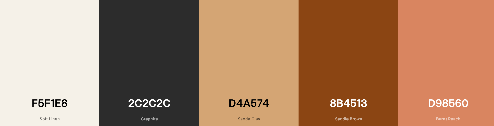
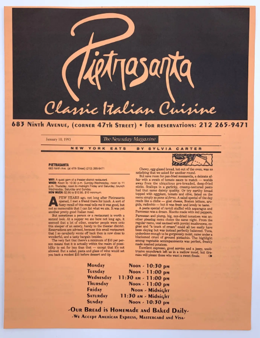
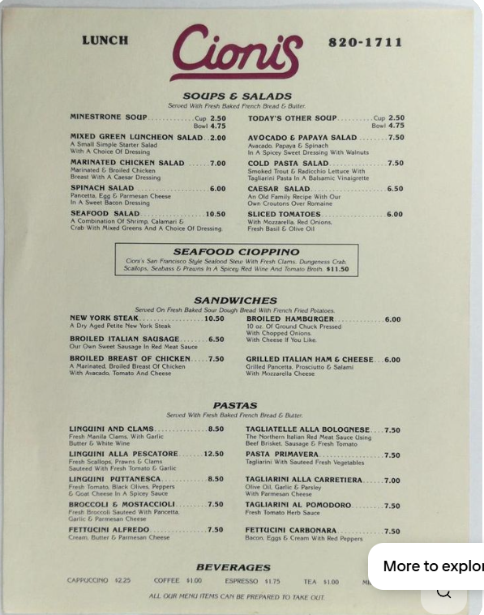
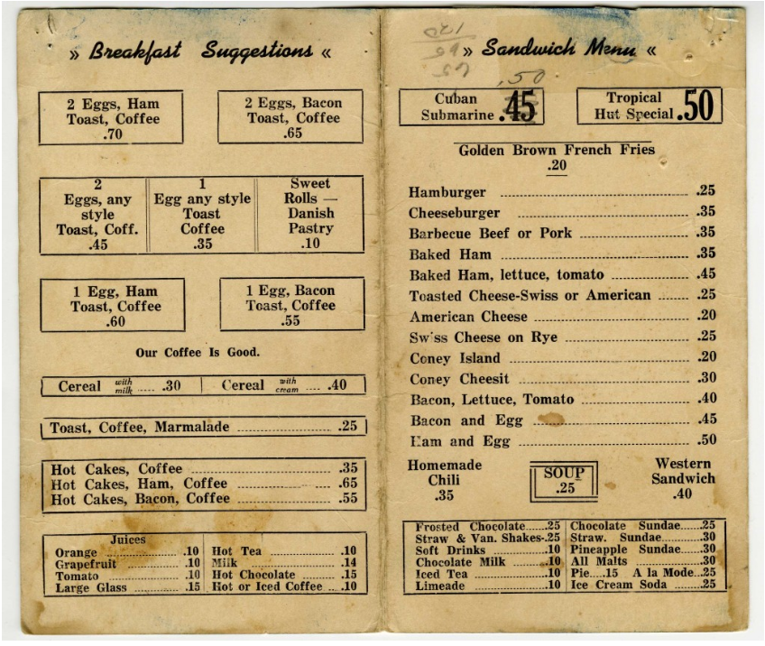

# **Dine-Together**

### By *Ashe Urban*

---

## Table of Contents

- [Project Overview](#project-overview)
- [Technologies Used](#technologies-used)
- [Architecture](#architecture)
  - [Service Layer Pattern](#service-layer-pattern)
  - [Firestore Schema](#firestore-schema)
- [Goals & Problems Solved](#goals--problems-solved)
- [Diagrams & Design](#diagrams--design)
- [Known Bugs](#known-bugs---updated-11226)
- [Setup / Installation](#setup--installation-main-branch)
- [Project Structure](#project-structure)
- [Development Roadmap](#development-roadmap)
- [Development Process Disclaimer](#development-process-disclaimer)
- [License](#license)

---

## **Project Overview**
**Ongoing Independent Project** 

Dine Together is an active, full-stack React prototype exploring how social restaurant discovery and shared dining experiences can live in one place. The application allows users to create and share restaurant posts, save places they want to try, and explore dining recommendations through a community-driven feed.

The current JavaScript MVP focuses on core social functionality and scalable architecture, including Firebase Authentication, Firestore data modeling, protected routes, and a service-layer approach that separates UI concerns from data access. As part of this phase, the application will integrate the Google Places API to support real restaurant search, autocomplete, and enriched place data within the app experience.

Following MVP polish, the project is planned to be refactored to TypeScript with expanded tooling and libraries to support larger user bases and more advanced features. Future phases aim to introduce deeper social connections and explore APIs that enable in-app reservation workflows, building toward a more complete end-to-end dining coordination platform.

---

**Current Status:** Core social features complete - users can post restaurants, save places, view other profiles, and browse a shared feed. PlaceProfile architecture in place with presentational components. Next: "Saved by" display, then Google Places API integration.

---

**Remodel branch** (this branch) is the active development branch where all new work happens. All features are implemented here first.

**Main branch** is a functional snapshot synced with remodel on 2025-12-04. It represents the current state of work and runs without errors, though some features are pending implementation.

| Branch | Status | Focus |
|--------|--------|-------|
| **remodel** | Active Development | All new work developed here. |
| **main** | Development Snapshot (2025-12-04) | Synced with remodel. Functional snapshot representing current state of active development. |
| **Legacy** | Early prototype, capstone project | For memories. |

---
>>>>>>> remodel

## **Technologies Used**

| Core | Frontend | APIs / BaaS | Architecture |
|------|----------|-------------|---------|
| JavaScript, JSX | React 18 | Firebase (Auth, Firestore) | Service Layer Pattern |
| CSS | Styled Components | Google Places API *(In Progress)* | Centralized Styling |

---

## **Architecture**

This project uses a **service-layer pattern** to separate concerns and keep components clean:

- **Posts & Places Collections** — Posts (social wrappers with captions) reference Places (restaurant data) by ID. One Place can be referenced by multiple Posts, keeping data normalized and shareable.
- **Service Layer** (`firebaseService.js`) — Centralizes all Firebase operations (auth, CRUD, subscriptions) and joins Post + Place data at the service level, so components receive complete data in props.
- **Custom Hooks** — 9 reusable hooks manage component state (data subscriptions, form handling, edit modes), promoting code reuse and testability.
- **Styled Components** — Centralized styling system with 8 style files, maintaining consistent theme and visual language across the app.

This architecture scales cleanly: adding Google Places API integration requires changes only to the service layer and firebaseService.js, not to component logic.

### **Service Layer Pattern**

The **service layer** (`firebaseService.js`) sits between components and external services (Firebase, APIs). Instead of components calling Firebase directly, they call service functions.

**Benefits:**
- **Separation of concerns** — Components focus on UI; service layer handles data logic
- **Reusability** — Multiple components can use the same service functions without duplication
- **Testability** — Service logic can be tested independently from UI
- **Flexibility** — Swapping Firebase for a different backend requires changes only in the service layer
- **API Integration** — Adding Google Places API calls happens in the service layer without touching components

**Example:** When Explore.js needs to search restaurants, it will call `firebaseService.searchRestaurants()` instead of directly calling Google Places API. The service layer handles the API call, error handling, and data transformation. Components receive clean data ready to display.

### **Firestore Schema**

```
firestore/
├── posts/
│   └── {postId}
│       ├── userId (string) - Author's Firebase UID
│       ├── authorUsername (string) - Denormalized for Feed display
│       ├── caption (string) - Optional social sharing text
│       ├── placeId (string) - Reference to places collection
│       └── timeOpen (timestamp) - When post was created
│
├── places/
│   └── {placeId}
│       ├── restaurantName (string)
│       ├── restaurantAddress (string)
│       ├── notes (string) - User observations/details // will move to separate wrapper
│       ├── priceLevel (number) - 1-4 price indicator
│       ├── rating (number) - Google Places rating
│       ├── userRatingsTotal (number) - Number of ratings
│       └── createdAt (timestamp) - When place was added to system
│
├── placeSavedBy/{placeId}/
│   └── users/{userId}
│       └── timeAdded (timestamp) - When user saved this place
│
└── users/{userId}/
    ├── username (string)
    ├── email (string)
    ├── bio (object) - User profile bio fields
    │   ├── bestMeal (string) - Best meal of my life (~75 chars)
    │   ├── goToMeals (string) - My go-to meals (~75 chars)
    │   └── aboutMe (string) - About me (~150 chars)
    └── userPlaces/ (subcollection)
        └── {placeId}
            └── timeAdded (timestamp) - When user saved this place
```

**Key Points:**
- Posts reference Places by ID (one Place can be referenced by multiple Posts)
- userPlaces subcollection links users to their saved restaurants
- Service layer joins Post + Place data when fetching (username denormalized to avoid N+1)
- Place data fetched per-item (N+1 pattern, flagged for optimization in TypeScript refactor)

---

## **Goals & Problems Solved**

| Goal | Problem Solved |
|------|----------------|
| Make coordinating dinners easy | Centralize choices and preferences |
| Support local restaurant exposure | Organize by location and interest |
| Explore scalable backends | Firebase for login and data persistence |

---

## **Diagrams & Design**
The inspiration for the aesthetic of this project is vintage menus. Colors were selected that provide a sense of nostalgia and warmth. Using this app should feel a bit like browsing an old menu for a favorite dish.





---

## **Known Bugs - Updated 1/15/26**
- **Global Notes:** Notes are stored on global `places` collection. When any user edits notes, it changes for all users. Will be fixed with NotesSection architecture (per-user notes in userPlaces subcollection) after API integration.

---

## **Setup / Installation (Main Branch)**
> You need a Firebase project and a local environment file to run the app.

1. **Clone and install**
   ```bash
   git clone https://github.com/AsheUrban/Dine-Together.git
   cd Dine-Together
   npm install
   ```

2. **Create a Firebase project**
   - Go to [Firebase Console](https://console.firebase.google.com) and create a new project.
   - Add a **Web App** to retrieve your Firebase config (API key, project ID, etc.).
   - Enable **Authentication** (Email/Password or Google Sign-In) under *Build → Authentication*.
   - Create a **Cloud Firestore** database (test or production mode is fine).

3. **Create `.env.local` (required)**
   - In the project root, create a file named `.env.local`
   - Add your Firebase config variables exactly as they appear in your Firebase console:  
     ```bash
     REACT_APP_FIREBASE_API_KEY=YOUR_API_KEY
     REACT_APP_FIREBASE_AUTH_DOMAIN=YOUR_PROJECT.firebaseapp.com
     REACT_APP_FIREBASE_PROJECT_ID=YOUR_PROJECT_ID
     REACT_APP_FIREBASE_STORAGE_BUCKET=YOUR_PROJECT.appspot.com
     REACT_APP_FIREBASE_MESSAGING_SENDER_ID=YOUR_SENDER_ID
     REACT_APP_FIREBASE_APP_ID=YOUR_APP_ID
     ```
   - Add `.env.local` to `.gitignore` and **do not commit** this file.

4. **Run the app**
   ```bash
   npm run build
   npm start
   ```
   - Open [http://localhost:3000](http://localhost:3000) in your browser.

> **Note:**  
> - If Firestore reads/writes fail, check your **Firebase Rules** and confirm authentication is enabled.  
> - The app checks `auth.currentUser` to gate access. You must log in before creating or viewing posts.

---

## **Project Structure**

```
src/
├── components/ (30 files)
│   ├── ActionBar.js           (Fixed-bottom action container)
│   ├── App.js                 (Main app with routing & auth state)
│   ├── Avatar.js              (User avatar component)
│   ├── Background.js          (Background styling component)
│   ├── ConfirmDialog.js       (Modal confirmation for delete operations)
│   ├── EditPlaceForm.js       (Edit place information)
│   ├── EditPostForm.js        (Edit post caption)
│   ├── EditUserProfileForm.js (Edit user profile bio)
│   ├── Explore.js             (Search restaurants & manual add - WIP)
│   ├── Feed.js                (Display all posts from all users)
│   ├── Header.js              (Navigation header with user info)
│   ├── KebabMenu.js           (Reusable dropdown menu for actions)
│   ├── NewPlaceForm.js        (Create new place)
│   ├── NewPostForm.js         (Create new post)
│   ├── NewProfileForm.js      (New user profile setup)
│   ├── Place.js               (Individual place card component)
│   ├── PlaceDetail.js         (Restaurant info display - purely presentational)
│   ├── PlaceGrid.js           (Grid display of places)
│   ├── PlaceList.js           (List display of places)
│   ├── PlaceProfile.js        (Feature container for viewing/interacting with a place)
│   ├── Post.js                (Individual social post component with ownership)
│   ├── PostList.js            (List display of posts)
│   ├── ProtectedRoute.js      (Auth-gated route wrapper)
│   ├── ReusablePlaceForm.js   (Reusable form component for places)
│   ├── ReusablePostForm.js    (Reusable form component for posts)
│   ├── ReusableProfileForm.js (Reusable form component for profiles)
│   ├── SignIn.js              (Sign in page)
│   ├── SignUp.js              (Sign up page)
│   ├── UserDetails.js         (User bio section)
│   └── UserProfile.js         (User profile with Posts and Restaurants tabs)
├── hooks/
│   ├── allPosts.js            (Subscribe to all posts for Feed)
│   ├── editMode.js            (Toggle edit/view state)
│   ├── formSubmit.js          (Form submission with loading/error states)
│   ├── placeSaveState.js      (Manage saved place state & "saved by" display)
│   ├── placeSelection.js      (Track selected place)
│   ├── placeUpdate.js         (Handle place update logic)
│   └── user.js                (Current user state with subscription pattern)
├── services/
│   └── firebaseService.js     (Firebase CRUD and real-time subscriptions)
├── styles/
│   ├── formStyles.js          (Form & input styled components)
│   ├── globalStyles.js        (Global theme & typography)
│   ├── postStyles.js          (Post card styled components)
│   ├── placeStyles.js         (Place card styled components)
│   ├── profileStyles.js       (Profile page styled components)
│   ├── avatarStyles.js        (Avatar styled components)
│   ├── FeedStyles.js          (Feed page styled components)
│   └── index.js               (Centralized style exports)
├── firebase.js                (Firebase configuration)
└── mood/                      (UI/UX design reference images)
```

---

## **Development Roadmap**

### **Phase 1: JavaScript MVP (Current - Remodel Branch)**

**Completed:**
- Posts/Places architectural separation (two Firestore collections)
- Profile page with tabbed interface (Posts | Restaurants)
- Place edit/update and delete functionality
- 7 custom hooks for scalable state management
- Vintage menu aesthetic with centralized styling
- KebabMenu integration across Feed, Profile, and PlaceProfile
- ConfirmDialog for delete confirmations
- CircularBackButton for consistent back/cancel UX
- Post edit/delete functionality
- View other users' profiles
- PlaceProfile architecture (PlaceDetail purely presentational, PlaceProfile as feature container)
- ActionBar component for fixed-bottom actions

**Current Sprint:**
- "Saved by" display in ActionBar and PlaceCard
- ActionBar consistency across app

### **Phase 2: Google Places API Integration**

1. Google Places Autocomplete in Explore
2. Google Places Details API for full restaurant data
3. Google Photos API for restaurant images
4. Combined search (restaurants + people)
5. Manual entry as fallback when API returns no results

### **Phase 3: Design with Real Data**

- NotesSection component (design with actual photos/data)
- Notes schema update (generalNote/privateNote in userPlaces)
- "Create Post" button in PlaceProfile

### **Phase 4: Polish**

- Form validation and error handling
- Loading state improvements (fix loading flash bug)
- Code cleanup

**TypeScript Refactor (Post-MVP)**

After the JavaScript version is finalized:
- Migrate codebase to TypeScript
- Introduce React Query for advanced state management
- Add Zod/Yup for schema validation
- Implement Suspense for async boundaries
- Build foundation for social features (friends, connections, reservations)

---

## **Development Process Disclaimer**

This project was designed and developed by Ashe Urban with the support of Claude AI.

---

## **License**

**All Rights Reserved** — This project is proprietary software.

Unauthorized use, reproduction, modification, or distribution is prohibited without explicit written permission from the author.

For inquiries regarding licensing or commercial use, contact: [theasheurban@gmail.com](mailto:theasheurban@gmail.com)

Copyright © 2026
*Ashe Urban*

> Reference: [Create React App docs](https://create-react-app.dev/)