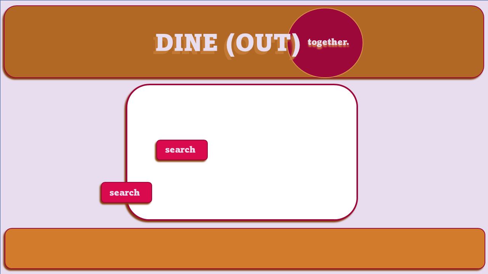
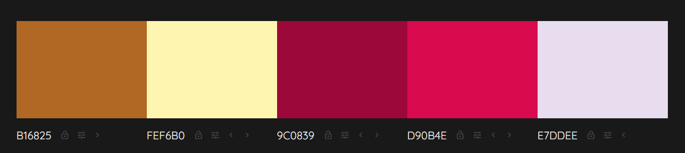
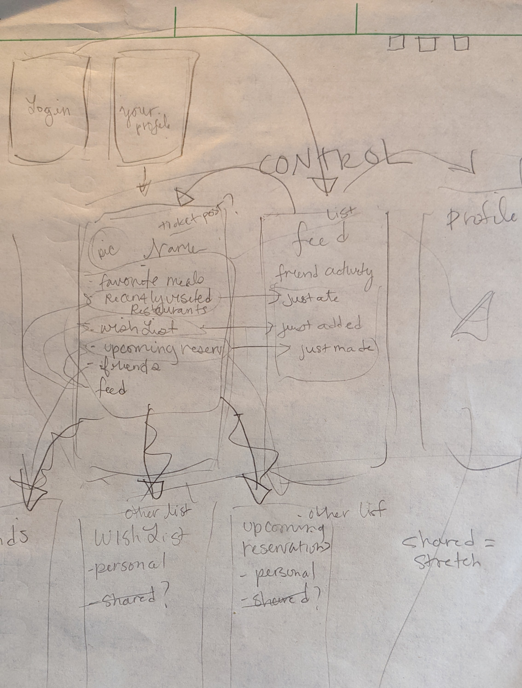
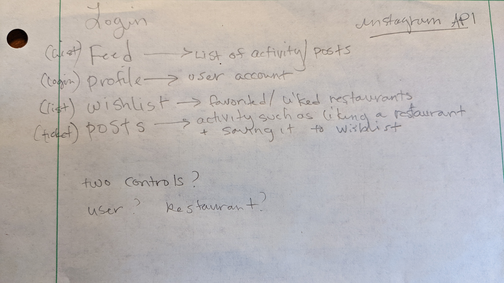

# **Dine-Together**

### By *Ashe Urban*

---

## **Project Overview**

### **Branch Status**

| Branch | Status | Focus |
|--------|--------|-------|
| **remodel** | Active Development | Posts/Places separation, KebabMenu, ConfirmDialog, tabbed Profile interface, place management |
| **main** | Stable MVP | Foundation with auth, profiles, protected routes, service-layer architecture |

**Capstone Project** — React-based web application using **Firebase** (Auth + Firestore) with a modern, scalable service-layer architecture.

Dine-Together is a prototype React app designed with a single goal in mind: to make planning dinners with friends simple. No more back-and-forth, easily see which restaurants all parties are interested in going to, make a reservation in app, everyone gets notified. Done. While this goal was ambitious and not reached by this project, it continues to be an idea I have yet to see executed well and hope to return to one day!

The main branch features auth-gated UI, username profiles, protected routes, and a real-time post/queue experience backed by Firebase. The codebase has been refactored with a clean service-layer architecture to support future API integrations (Google Places API). For active development with advanced features, see the **remodel** branch.

---

## **Technologies Used**

| Core | Frontend | APIs / BaaS | Architecture |
|------|----------|-------------|---------|
| JavaScript, JSX | React 18 | **Firebase** (Auth, Firestore) | Service Layer Pattern |
| CSS | Styled Components | **Google Places API** *(In Progress)* | Centralized Styling |

---

## **Description**
The MVP goal was a React application with:
- User authentication and profile management
- A wishlist/queue of places to eat
- Browser-based API integration (Google Places)

**Current Status:** The codebase has been significantly refactored with a clean service-layer architecture. The **main** branch now features:
- Protected routes with centralized authentication
- Username-based user profiles with Firestore integration
- Separate sign-up and sign-in pages
- Reusable styled components in a centralized styles directory
- Firebase service layer for database operations
- Ready for Google Places API integration

---

## **Goals & Problems Solved**

| Goal | Problem Solved |
|------|----------------|
| Make coordinating dinners easy | Centralize choices and preferences |
| Support local restaurant exposure | Organize by location and interest |
| Explore scalable backends | Firebase for login and data persistence |

---

## **Diagrams & Design**
*  - _Mock up of branding and colors_
*  - _Color palette (HEX)_
*  - _System & component diagram_
*  - _Additional planning notes_

---

## **Challenges Encountered & Solutions**
- **CORS Limitations:** Google Places API has browser-based CORS restrictions. Solution: Using `@react-google-maps/api` library which handles this properly.
- **Architecture Scalability:** Original monolithic component structure made it difficult to add new features cleanly. Solution: Refactored to service-layer architecture with reusable styled components.
- **Code Duplication:** Styled components were repeated across multiple files. Solution: Centralized all styles in `src/styles/formStyles.js`.
- **Authentication Flow:** Sign up and sign in were on the same page causing UX confusion. Solution: Separated into distinct routes with proper navigation.

---

## **Known Bugs**
- Google Places integration is **in progress** (ready for development).

**Recently Fixed:**
- Form validation and error handling — Sign up, sign in, and post creation now validate input with user-friendly error messages.

---

## **Setup / Installation (Main Branch)**
> You need a Firebase project and a local environment file to run the app.

1. **Clone and install**
   ```bash
   git clone https://github.com/AsheUrban/Dine-Together.git
   cd Dine-Together
   npm install
   ```

2. **Create a Firebase project**
   - Go to [Firebase Console](https://console.firebase.google.com) and create a new project.
   - Add a **Web App** to retrieve your Firebase config (API key, project ID, etc.).
   - Enable **Authentication** (Email/Password or Google Sign-In) under *Build → Authentication*.
   - Create a **Cloud Firestore** database (test or production mode is fine).

3. **Create `.env.local` (required)**
   - In the project root, create a file named `.env.local`
   - Add your Firebase config variables exactly as they appear in your Firebase console:  
     ```bash
     REACT_APP_FIREBASE_API_KEY=YOUR_API_KEY
     REACT_APP_FIREBASE_AUTH_DOMAIN=YOUR_PROJECT.firebaseapp.com
     REACT_APP_FIREBASE_PROJECT_ID=YOUR_PROJECT_ID
     REACT_APP_FIREBASE_STORAGE_BUCKET=YOUR_PROJECT.appspot.com
     REACT_APP_FIREBASE_MESSAGING_SENDER_ID=YOUR_SENDER_ID
     REACT_APP_FIREBASE_APP_ID=YOUR_APP_ID
     ```
   - Add `.env.local` to `.gitignore` and **do not commit** this file.

4. **Run the app**
   ```bash
   npm run build
   npm start
   ```
   - Open [http://localhost:3000](http://localhost:3000) in your browser.

> **Note:**  
> - If Firestore reads/writes fail, check your **Firebase Rules** and confirm authentication is enabled.  
> - The app checks `auth.currentUser` to gate access. You must log in before creating or viewing posts.

---

## **Project Structure**

```
src/
├── components/
│   ├── App.js                 (Main app with routing & auth state)
│   ├── PostControl.js         (Container for post management)
│   ├── SignIn.js              (Sign in page)
│   ├── SignUp.js              (Sign up page)
│   ├── Header.js              (Navigation header with user info)
│   ├── Profile.js             (User profile page)
│   ├── ProtectedRoute.js      (Auth-gated route wrapper)
│   ├── PostList.js            (Display all posts)
│   ├── NewPostForm.js         (Create new post)
│   └── EditPostForm.js        (Edit existing post)
├── services/
│   ├── firebaseService.js     (Firebase CRUD operations)
│   └── placesService.js       (Google Places API - ready for implementation)
├── styles/
│   └── formStyles.js          (Centralized styled components)
└── firebase.js                (Firebase configuration)
```

---

## **Next Steps**

The codebase is ready for Google Places API integration:

1. Install `@react-google-maps/api` package
2. Implement `placesService.js` with restaurant search functionality
3. Create `restaurantDataService.js` as an abstraction layer
4. Integrate search into `NewPostForm.js`
5. Add restaurant autocomplete and details

---

## **License**

**All Rights Reserved** — This project is proprietary software.

Unauthorized use, reproduction, modification, or distribution is prohibited without explicit written permission from the author.

For inquiries regarding licensing or commercial use, contact: [theasheurban@gmail.com](mailto:theasheurban@gmail.com)

Copyright © 2025
*Ashe Urban*

> Reference: [Create React App docs](https://create-react-app.dev/)